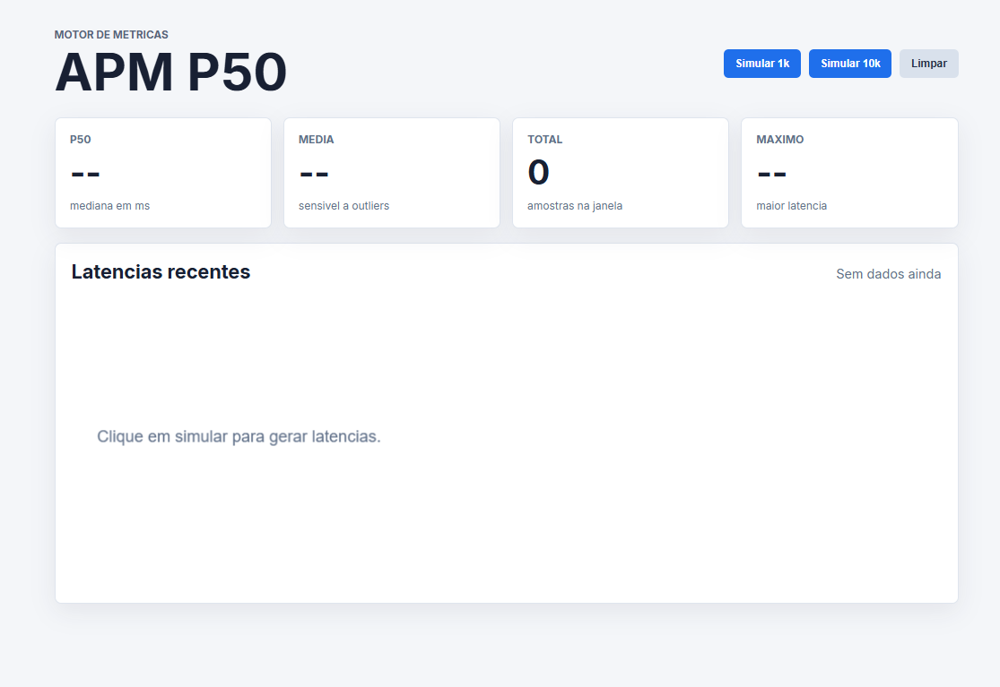
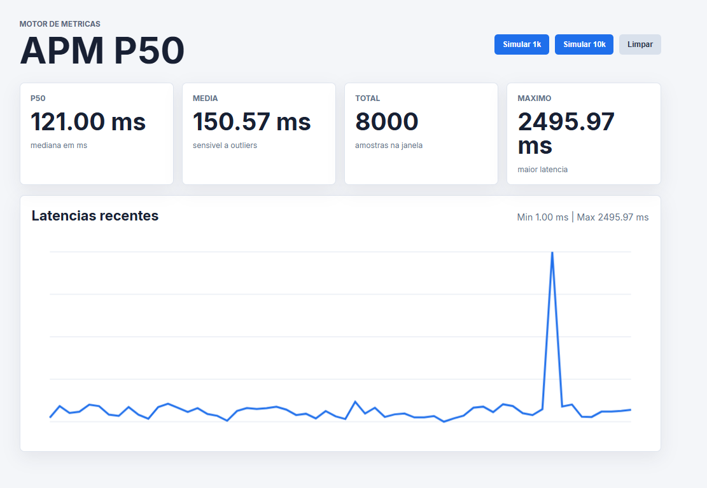
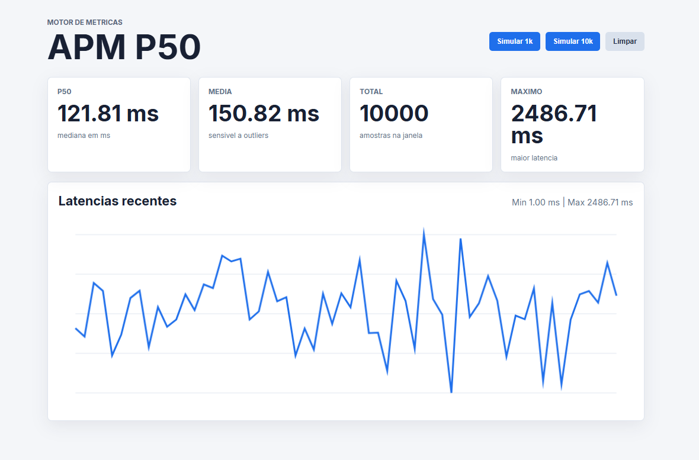
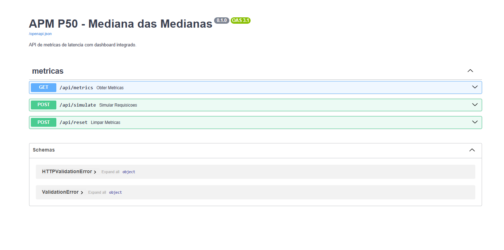
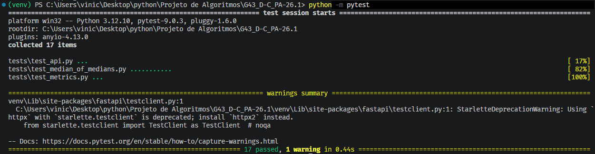

# Motor de métricas e Dashboard APM P50

Projeto da disciplina Projeto de Algoritmos para demonstrar o cálculo do P50 de latências usando o algoritmo **Mediana das Medianas**.

## Objetivo

Construir uma API em Python com interface web integrada para simular requisições de servidores e acompanhar métricas de performance. O foco é mostrar por que a mediana e mais robusta que a média em cenarios de Application Performance Monitoring(APM), onde poucos timeouts podem distorcer a média.

## Funcionalidades

- API FastAPI com endpoints para métricas, simulacao e reset.
- Dashboard web servido pela propria aplicacao.
- Simulador de latências com outliers configuráveis.
- Calculo de P50 usando Mediana das Medianas, sem ordenar a lista completa.
- Testes automatizados para algoritmo, métricas e rotas principais.

## Estrutura

```text
main.py
img/
src/app/
  server.py
  api.py
  metrics.py
  median_of_medians.py
  simulator.py
  storage.py
  static/
    index.html
    styles.css
    app.js
tests/
  test_api.py
  test_median_of_medians.py
  test_metrics.py
```

## Requisitos

- Python 3.10 ou superior
- pip

## Instalacao

```bash
python -m venv venv
venv\Scripts\activate
pip install -r requirements.txt
```

## Como executar

O jeito mais simples é pela raiz do projeto:

```bash
python main.py
```

Depois acesse:

```text
http://127.0.0.1:8000
```

Tambem é possivel executar diretamente com Uvicorn:

```bash
uvicorn src.app.server:app --reload
```

A documentação automática da API fica em:

```text
http://127.0.0.1:8000/docs
```

## Como o dashboard funciona

1. A tela inicial é servida pelo FastAPI em `/`.
2. Os arquivos de interface ficam em `src/app/static/`.
3. Ao clicar em `Simular 1k` ou `Simular 10k`, o JavaScript chama `POST /api/simulate`.
4. A API gera latências simuladas, guarda em memória e recalcula as métricas.
5. O dashboard busca `GET /api/metrics` a cada 5 segundos para atualizar P50, média, total, máximo e gráfico.

## Video Explicativo

[🔗 Assista ao vídeo completo explicando o projeto e algoritmos](https://youtu.be/DWiuwpaMwsU)

### Dashboard inicial



### Dashboard após simulação




### Documentação da API



### Testes automatizados



## Endpoints principais

- `GET /api/metrics`: retorna métricas da janela atual.
- `POST /api/simulate?count=1000`: gera latências simuladas.
- `POST /api/reset`: limpa os dados em memória.

## Como testar

Execute na raiz do projeto:

```bash
pytest
```

Se o comando `pytest` não for reconhecido, use:

```bash
python -m pytest
```

## Observacao sobre o algoritmo

A media simples é sensivel a outliers: uma unica requisição com timeout pode elevar muito o resultado. O P50 representa o ponto central das latências e, neste projeto, é calculado com seleção deterministica por Mediana das Medianas, que encontra a estatística de ordem desejada em tempo linear no pior caso.
